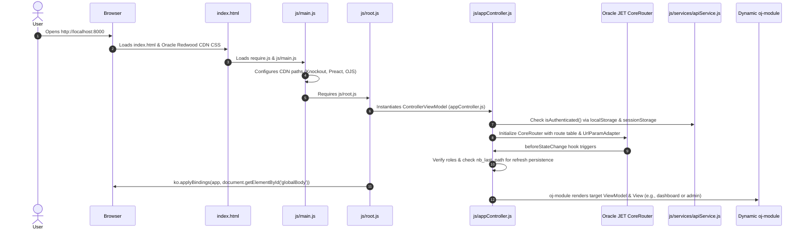
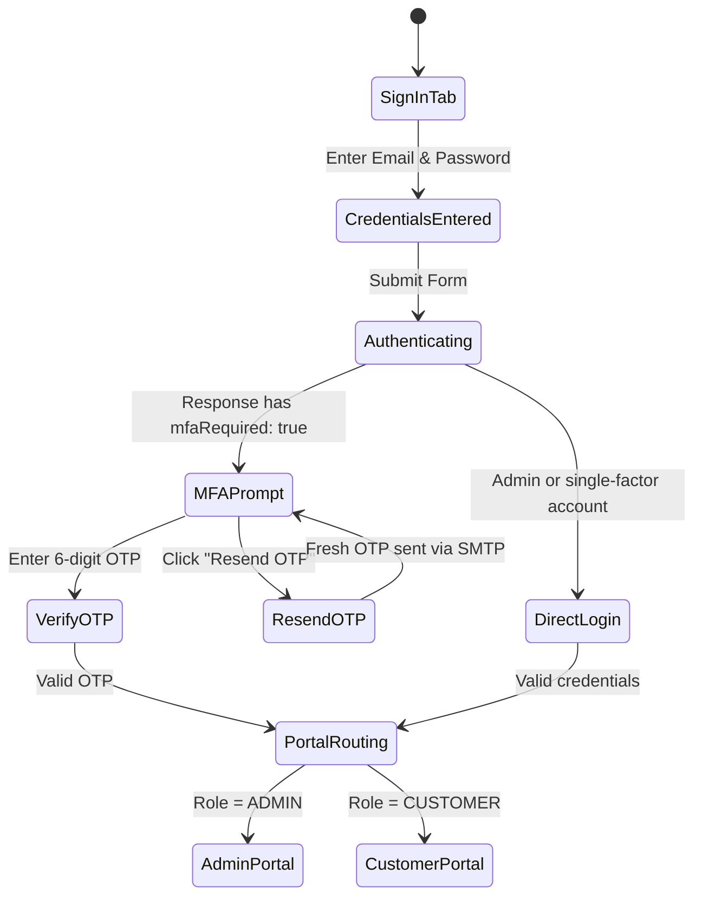
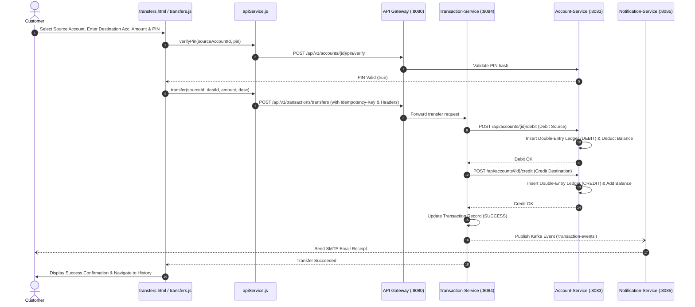
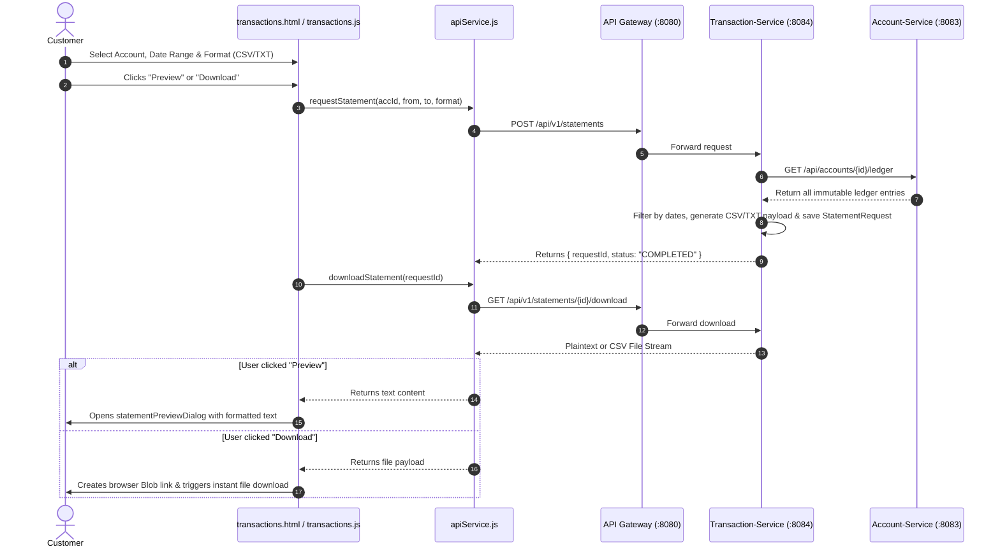

# NetBanking Enterprise Frontend: Comprehensive Architecture & Technical Reference

> **Platform Version:** NetBanking Redwood Enterprise v2.0  
> **Framework:** Oracle JavaScript Extension Toolkit (Oracle JET) v16.0.0 (AMD / RequireJS / Knockout.js)  
> **Design System:** Oracle Redwood UX Design System  
> **API Gateway Target:** Spring Cloud Gateway (`http://localhost:8080`)  

---

## 1. High-Level Architectural Overview

The **NetBanking Frontend** is an enterprise Single Page Application (SPA) designed using **Oracle JET (JavaScript Extension Toolkit)** and the **Oracle Redwood Design System**. It adheres strictly to the **Model-View-ViewModel (MVVM)** architectural pattern and leverages **Asynchronous Module Definition (AMD)** via RequireJS for modularity, lazy-loading, and decoupled dependency injection.

### Core Architectural Principles

```mermaid
graph TD
    User([User Browser]) <--> Index[index.html & Redwood Shell]
    Index <--> Boot[main.js & root.js]
    Boot <--> AppCtrl[appController.js / Global Router & Auth Guards]
    AppCtrl <--> ViewContainer["oj-module Dynamic Viewport"]
    
    subgraph ViewModels [MVVM ViewModels (Knockout.js)]
        LoginVM[login.js]
        DashVM[dashboard.js]
        AccVM[accounts.js]
        TxVM[transactions.js]
        AdminVM[admin.js]
        NotifVM[notifications.js]
    end

    subgraph Views [Declarative HTML Views (Redwood)]
        LoginV[login.html]
        DashV[dashboard.html]
        AccV[accounts.html]
        TxV[transactions.html]
        AdminV[admin.html]
        NotifV[notifications.html]
    end

    ViewContainer -.-> ViewModels
    ViewModels <--> Views

    ViewModels <--> API[apiService.js - Centralized API Service]
    API <--> Gateway["Spring Cloud API Gateway (:8080)"]
    
    subgraph Microservices [Spring Boot Microservices Fleet]
        Gateway <--> AuthSvc["Auth Service (:8081)"]
        Gateway <--> UserSvc["User Service (:8082)"]
        Gateway <--> AccSvc["Account Service (:8083)"]
        Gateway <--> TxSvc["Transaction Service (:8084)"]
        Gateway <--> NotifSvc["Notification Service (:8085)"]
    end
```

---

## 2. Directory & File Inventory

```
netbanking-frontend/
├── index.html                      # Root HTML5 host & Redwood app shell (Header, Nav, Drawer, Main, Footer)
├── oraclejetconfig.json            # Oracle JET CLI configuration
├── package.json                    # Project metadata & npm dependencies
├── server.js                       # Local static HTTP dev server (Node.js)
├── src/
│   ├── index.html                  # Source root HTML template
│   ├── css/
│   │   ├── app.css                 # Custom Redwood design system classes, variables & micro-animations
│   │   └── app-min.css             # Minified utility overrides
│   └── js/
│       ├── main.js                 # RequireJS config, Oracle CDN bundle mapping & app entry point
│       ├── root.js                 # DOM readiness bootstrap & global body Knockout binding
│       ├── appController.js        # Global App Controller: routing, state persistence, auth guards, drawer
│       ├── accUtils.js             # Accessibility announcement utilities
│       ├── path_mapping.json       # Oracle JET 3rd-party library path mappings
│       ├── services/
│           └── apiService.js       # Centralized REST client, JWT storage, refresh cycle, microservices SDK
│       ├── viewModels/             # Knockout ViewModels (Business logic, observables & controllers)
│       │   ├── login.js            # Login, MFA OTP, Registration, 3-step Password Reset
│       │   ├── dashboard.js        # Customer dashboard, KPI balances, Profile modal, Account opening
│       │   ├── accounts.js         # Account cards, 4-digit PIN setup/change dialog, balance inquiries
│       │   ├── transfers.js        # Immediate/scheduled fund transfer, PIN authorization, validation
│       │   ├── transactions.js     # Transaction history, 10-column ledger, Statement generation/download
│       │   ├── admin.js            # Admin Command Center: Account governance, ledger inspect, status, fleet
│       │   └── notifications.js    # Transaction audit logs & compliance ledger modal inspector
│       └── views/                  # Declarative HTML Views (Redwood UI markup with data-bind attributes)
│           ├── login.html
│           ├── dashboard.html
│           ├── accounts.html
│           ├── transfers.html
│           ├── transactions.html
│           ├── admin.html
│           └── notifications.html
```

---

## 3. Core Architectural Concepts

### 3.1 Model-View-ViewModel (MVVM) Pattern
In Oracle JET:
- **View (`.html`)**: Pure declarative HTML5 containing standard HTML elements and Oracle JET custom web components (prefixed with `oj-`). Data is bound using Knockout binding syntax (`data-bind="..."` or `:attr="[[...]]"`).
- **ViewModel (`.js`)**: An AMD JavaScript module exporting a constructor function. It encapsulates UI state (using Knockout Observables), business logic, event handlers, and data transformations.
- **Model**: Plain JavaScript objects, REST responses, and DTO structures returned by the Spring Boot microservices via `apiService.js`.

### 3.2 Knockout.js Reactive State Model
The frontend uses Knockout's reactive primitives to synchronize the UI:
1. `ko.observable(value)`: Tracks primitive state (strings, numbers, booleans) and notifies subscriber elements when the value changes.
2. `ko.observableArray([])`: Tracks lists of items (accounts, transaction history, audit logs), updating tables and dropdowns automatically when items are pushed, spliced, or replaced.
3. `ko.computed(() => ...)`: Dynamically computes derived values (e.g., filtered transaction lists, search queries, credit/debit totals). Automatically updates when any dependent observable changes.
4. `observable.subscribe(callback)`: Listens for direct value mutations (e.g., reloading the 10-column ledger when the user switches account dropdown options).

### 3.3 Asynchronous Module Definition (AMD) & RequireJS
Every JavaScript file is wrapped in an AMD `define([...], function(...) { ... })` declaration. RequireJS asynchronously resolves dependencies from the Oracle CDN and local service directories, ensuring scripts execute only when all required components are loaded.

---

## 4. Lifecycle & Application Bootstrap Flow



### Detailed Bootstrap Steps:
1. **HTML & CDN Loading ([index.html](file:///c:/Users/Varshit%20G/Documents/Project/netbanking-frontend/src/index.html))**: Loads Oracle Redwood CSS (`oj-redwood-min.css`), UX icon fonts (`ojuxIconFont.min.css`), custom CSS (`app.css`), and the RequireJS engine from the Oracle CDN.
2. **RequireJS Configuration ([main.js](file:///c:/Users/Varshit%20G/Documents/Project/netbanking-frontend/src/js/main.js))**: Configures base URLs, path aliases for Oracle JET components (`ojs`), Knockout 3.5.3, Preact, Hammer.js, and signals.
3. **DOM Ready & Top-Level Binding ([root.js](file:///c:/Users/Varshit%20G/Documents/Project/netbanking-frontend/src/js/root.js))**: Calls `Bootstrap.whenDocumentReady()`. Once ready, applies Knockout bindings for `appController.js` to `#globalBody`.
4. **App Controller Initialization ([appController.js](file:///c:/Users/Varshit%20G/Documents/Project/netbanking-frontend/src/js/appController.js))**:
   - Reads auth tokens from storage.
   - Configures `CoreRouter`, `ModuleRouterAdapter`, `KnockoutRouterAdapter`, and `UrlParamAdapter`.
   - Binds `navDataProvider` to the top Redwood navigation bar and mobile drawer.
   - Restores saved URL paths on refresh.
5. **View Loading ([oj-module](file:///c:/Users/Varshit%20G/Documents/Project/netbanking-frontend/src/index.html#L128-L130))**: `<oj-module config="[[moduleAdapter.koObservableConfig]]"></oj-module>` loads the matching view (`views/<path>.html`) and view model (`viewModels/<path>.js`).

---

## 5. File-by-File Breakdown & Technical Documentation

### 5.1 [index.html](file:///c:/Users/Varshit%20G/Documents/Project/netbanking-frontend/src/index.html) (Application Shell)
The single HTML file hosting the entire UI.
- **Redwood Drawer (`oj-drawer-popup`)**: Slide-out menu for mobile viewports displaying branding, customer email, user role badge (`ADMIN` or `CUSTOMER`), and navigation items.
- **Header (`<header class="nb-header">`)**: Global branding bar containing the Bank logo, notification bell icon, user chip avatar, role indicator, and sign-out button.
- **Navigation Bar (`oj-tab-bar`)**: Desktop navigation tabs dynamically filtered based on whether the logged-in user is an Administrator or Retail Customer.
- **Main Viewport (`<main>`)**: Houses `<oj-module>` which swaps views on route changes without reloading the page.
- **Footer (`<footer>`)**: Displays system health links, API Gateway URL (:8080), Swagger UI links, and Eureka service discovery telemetry for administrative review.

---

### 5.2 [appController.js](file:///c:/Users/Varshit%20G/Documents/Project/netbanking-frontend/src/js/appController.js) (Global State & Route Controller)
Acts as the central nervous system of the client application.
- **Route Definitions (`getAllNavData`)**:
  - `''`: Dynamically redirects to `'admin'`, `'dashboard'`, or `'login'` depending on session state.
  - `'admin'`: Admin Command Center (Admin only).
  - `'dashboard'`: Customer Portfolio Dashboard (Customer only).
  - `'accounts'`: Bank Account Management & PIN setup (Customer only).
  - `'transfers'`: Double-Entry Fund Transfers (Customer only).
  - `'transactions'`: Transaction History & Statements (Customer only).
  - `'notifications'`: Transaction Audit Logs (Admin & Customer).
  - `'login'`: Sign In, Register & Password Reset.
- **Role Isolation & Navigation Guards (`beforeStateChange`)**:
  - Unauthenticated users attempting to access protected routes are denied and redirected to `login`.
  - Customers attempting to access `admin` are rejected and redirected to `dashboard`.
  - Admins navigating to customer retail views (`accounts`, `transfers`, etc.) are redirected to `admin`.
  - Authenticated users loading `login` are forwarded directly to their dashboard.
- **State Persistence Across Page Refresh**:
  - Stores the active route in `localStorage.getItem('nb_last_path')`.
  - When `router.sync()` completes on F5 browser reload, checks authentication state and restores the exact saved route instead of resetting to login.
- **Auth Event Listener (`apiService.onAuthChange`)**:
  - Updates observables (`isLoggedIn`, `isAdmin`, `userLogin`, `userBadge`).
  - Refreshes navigation tabs via `getDisplayNavData()`.

---

### 5.3 [apiService.js](file:///c:/Users/Varshit%20G/Documents/Project/netbanking-frontend/src/js/services/apiService.js) (Centralized API Service)
A singleton service facilitating all communications with backend microservices through the Spring Cloud API Gateway at `http://localhost:8080`.

#### Key Responsibilities:
1. **Dual-Storage Session Management**:
   - Synchronizes `nb_access_token`, `nb_refresh_token`, and `nb_user` in both `localStorage` and `sessionStorage`.
   - Prevents session loss across browser tabs, windows, and page reloads.
2. **Automated Header Injection**:
   - Injects `Authorization: Bearer <token>` for all secured endpoints.
   - Automatically populates `X-Customer-Id`, `X-Customer-Email`, and `X-User-Email` extracted from the active session.
3. **Token Refresh Interceptor**:
   - Intercepts HTTP `401 Unauthorized` responses.
   - Automatically issues a refresh request to `/api/v1/auth/refresh`.
   - Retries the original request with the renewed token transparently.
4. **API Endpoint Mappings**:

| Domain | Method | Endpoint | Description |
|---|---|---|---|
| **Auth** | `login(email, password, otp)` | `POST /api/v1/auth/login` | Authenticates credentials; requests OTP if MFA is active |
| **Auth** | `verifyOtp(email, otp, purpose)` | `POST /api/v1/auth/verify-otp` | Validates MFA or password reset OTP |
| **Auth** | `forgotPassword(email)` | `POST /api/v1/auth/forgot-password` | Initiates reset OTP dispatch via SMTP |
| **Auth** | `resetPassword(token, newPass)` | `POST /api/v1/auth/reset-password` | Commits new password with reset authorization token |
| **Customer** | `getCustomerProfile(id)` | `GET /api/v1/customers/{id}/profile` | Fetches customer KYC profile details |
| **Customer** | `saveCustomerProfile(id, data)` | `POST /api/v1/customers/{id}/profile` | Creates or updates customer KYC profile |
| **Account** | `getMyAccounts()` | `GET /api/v1/accounts?customerId={id}` | Lists bank accounts for active customer |
| **Account** | `getAccountLedger(accId)` | `GET /api/v1/accounts/{id}/ledger` | Fetches 10-column double-entry ledger entries |
| **Account** | `setPin(accId, pin)` | `PUT /api/v1/accounts/{id}/pin` | Sets or updates 4-digit security PIN |
| **Account** | `verifyPin(accId, pin)` | `POST /api/v1/accounts/{id}/pin/verify` | Validates PIN prior to transfer |
| **Transfers** | `transfer(from, to, amt, desc, pin)` | `POST /api/v1/transactions/transfers` | Executes double-entry fund transfer with Idempotency Key |
| **Transactions** | `getCustomerTransactions(id)` | `GET /api/v1/transactions/customer/{id}` | Retrieves completed and pending transfers |
| **Statements** | `requestStatement(accId, from, to, type)` | `POST /api/v1/statements` | Initiates statement generation (CSV / TXT) |
| **Statements** | `downloadStatement(requestId)` | `GET /api/v1/statements/{id}/download` | Downloads statement text or CSV payload |
| **Admin** | `getAllAccounts()` | `GET /api/v1/accounts` | Admin inspection across all bank accounts |
| **Admin** | `changeAccountStatus(id, status)` | `PATCH /api/v1/accounts/{id}/status` | Admin status override (`ACTIVE`, `FROZEN`, `CLOSED`) |
| **Admin** | `creditAccount(id, amount, desc)` | `POST /api/v1/accounts/{id}/credits` | Admin direct credit posting / deposit |
| **Audit** | `getAllNotifications()` | `GET /api/v1/notifications` | Admin compliance transaction event stream |

---

### 5.4 [login.js](file:///c:/Users/Varshit%20G/Documents/Project/netbanking-frontend/src/js/viewModels/login.js) & [login.html](file:///c:/Users/Varshit%20G/Documents/Project/netbanking-frontend/src/js/views/login.html)
Encapsulates all entry authentication workflows in a clean 3-tab card:



#### Key Implementation Details:
- **Resend OTP Action (`handleResendLoginOtp`)**: Triggers a call to `apiService.login(email, password, null)` when the user is in MFA mode to dispatch a fresh 6-digit verification code.
- **Show Password Toggle Button**: Uses `:type="[[showPassword() ? 'text' : 'password']]"` and toggles `showPassword()`. Positioned inside the input wrapper and decoupled from error alerts so it never disappears on invalid password attempts. Browser-native reveal clearers (`::-ms-reveal`) are suppressed via CSS.
- **3-Step Password Reset Flow**:
  1. Step 1: Submits email -> issues OTP.
  2. Step 2: Validates OTP -> returns password reset authorization token.
  3. Step 3: Submits new password with token -> updates password and returns to sign-in.

---

### 5.5 [dashboard.js](file:///c:/Users/Varshit%20G/Documents/Project/netbanking-frontend/src/js/viewModels/dashboard.js) & [dashboard.html](file:///c:/Users/Varshit%20G/Documents/Project/netbanking-frontend/src/js/views/dashboard.html)
The central command view for retail customers.

#### Key Features:
- **KPI Metrics Cards**: Computes Total Combined Balance across accounts, Active Savings Balance, Active Current Balance, and Total Accounts held.
- **Customer Profile KYC Modal**:
  - Enforces `Date of Birth <= Current Date` (`attr: { max: maxDobDate }`).
  - Strictly requires a **10-digit mobile number** (`pattern="[0-9]{10}"` and `rawPhone.length === 10`).
  - Collects Address, City, State, and Postal Code.
- **Account Creation Enforcement**:
  - Enforces platform rule: **Maximum 1 Savings Account and 1 Current Account per customer**.
  - Disables creation buttons if the customer already holds both account types.
- **Recent Transaction Notice Feed**:
  - Automatically loads and filters recent notifications, excluding OTP/PIN security alerts and displaying only financial transaction dispatches.

---

### 5.6 [accounts.js](file:///c:/Users/Varshit%20G/Documents/Project/netbanking-frontend/src/js/viewModels/accounts.js) & [accounts.html](file:///c:/Users/Varshit%20G/Documents/Project/netbanking-frontend/src/js/views/accounts.html)
Manages the customer's portfolio of bank accounts.
- **Account Cards View**: Displays account number, account type (`SAVINGS` / `CURRENT`), balance, currency (`INR`), and status (`ACTIVE`, `PENDING_APPROVAL`, `FROZEN`, `CLOSED`).
- **4-Digit Security PIN Setup & Update Dialog**:
  - Modal dialog allowing customers to set or update their transaction security PIN.
  - Validates that the PIN is numeric, exactly 4 digits long, and matches the confirmation input.
  - Sends a `PUT` request to `/api/v1/accounts/{id}/pin`.
  - Dispatches an SMTP notification to the customer upon successful update.

---

### 5.7 [transfers.js](file:///c:/Users/Varshit%20G/Documents/Project/netbanking-frontend/src/js/viewModels/transfers.js) & [transfers.html](file:///c:/Users/Varshit%20G/Documents/Project/netbanking-frontend/src/js/views/transfers.html)
Facilitates double-entry fund transfers between accounts.

#### Execution Pipeline:
1. **Source Account Selection**: Populated from active accounts with sufficient balance.
2. **Destination Account Resolution**: Accepts either numeric database Account ID or formatted Account Number (`NB...`). Resolves destination account ID via API client.
3. **4-Digit PIN Pre-Verification**: Validates the PIN against `/api/v1/accounts/{id}/pin/verify` before dispatching funds.
4. **Idempotency Guarantee**: Generates a unique `Idempotency-Key` header (`TXN-<timestamp>-<random>`) to prevent duplicate debit/credit postings in case of network retries.
5. **Execution**: Dispatches `POST /api/v1/transactions/transfers` to `Transaction-Service`. Updates balances and redirects to Transaction History upon success.

---

### 5.8 [transactions.js](file:///c:/Users/Varshit%20G/Documents/Project/netbanking-frontend/src/js/viewModels/transactions.js) & [transactions.html](file:///c:/Users/Varshit%20G/Documents/Project/netbanking-frontend/src/js/views/transactions.html)
A financial portal divided into three dedicated sub-tabs:

#### Sub-Tab 1: Transaction History
- Displays completed and pending fund transfers.
- Computes credit/debit orientation dynamically relative to the filtered account: credits are displayed as `+ ₹` in green; debits are displayed as `- ₹` in red.
- Displays reference numbers (`transactionReference`), formatted timestamp (`initiatedAt || completedAt`), source account, destination account, amount, and status badges.
- Filterable by account and searchable by keyword.

#### Sub-Tab 2: Live Account Ledger (10 Columns)
- Direct integration with `Account-Service` (`/api/v1/accounts/{id}/ledger`).
- Renders the full 10-column double-entry ledger:
  1. `TRANSACTION_REFERENCE`
  2. `ENTRY_REFERENCE`
  3. `ENTRY_TYPE` (`CREDIT` / `DEBIT`)
  4. `AMOUNT`
  5. `BALANCE_BEFORE`
  6. `BALANCE_AFTER`
  7. `AVAILABLE_BALANCE_BEFORE`
  8. `AVAILABLE_BALANCE_AFTER`
  9. `DESCRIPTION`
  10. `CREATED_BY`
- Employs a Knockout subscription on `selectedLedgerAccountId` so changing accounts in the dropdown immediately loads the ledger entries.

#### Sub-Tab 3: Statements Archive & Generation
- **Statement Generator Form**: Allows selecting account, optional From Date, optional To Date, and format (`CSV` or `TXT`).
- **On-Screen Preview**: Downloads content and renders it inside an `<oj-dialog>` modal with monospace formatting before downloading.
- **Browser File Download**: Generates an in-memory `Blob` and triggers automated client-side file download.
- **Archive Table**: Lists previously requested statements with one-click **View** and **Download** actions.

---

### 5.9 [admin.js](file:///c:/Users/Varshit%20G/Documents/Project/netbanking-frontend/src/js/viewModels/admin.js) & [admin.html](file:///c:/Users/Varshit%20G/Documents/Project/netbanking-frontend/src/js/views/admin.html)
The Enterprise Administrator Command Center.

#### Tab Structure:
1. **Account Governance & Inspector (Default Tab)**:
   - **Account Table**: Lists all customer accounts across the bank.
   - **Inspect Action**: Click "Inspect" to populate Account Search & Balance Inspector.
   - **Administrative Status Override**: Allows transitioning accounts to `ACTIVE`, `FROZEN`, or `CLOSED`. When an account is activated, it automatically synchronizes the customer status in `User-Service` to `ACTIVE`.
   - **Direct Deposit / Credit Posting**: Allows administrators to post immediate credits/deposits to any account with custom descriptions.
2. **System Audit Logs & Double-Entry Ledger Inspector**:
   - Filtered exclusively to **Transaction Events** (`TRANSACTION`, `TRANSFER`, `CREDIT`, `DEBIT`, `DEPOSIT`, `LEDGER`), completely removing OTP & Auth and PIN & Security logs.
   - Displays real-time Kafka event streams and SMTP notifications from `Notification-Service`.
   - **Click-to-Inspect Ledger Modal**: Clicking any log row or clicking **Check Ledger** opens an `<oj-dialog>` displaying the 10-column financial ledger for that event's associated bank account.
3. **Microservices Fleet Monitor**:
   - Telemetry overview of all 7 microservices in the platform:
     - `API Gateway` (:8080)
     - `Eureka Registry` (:8761)
     - `Auth Service` (:8081)
     - `User Service` (:8082)
     - `Account Service` (:8083)
     - `Transaction Service` (:8084)
     - `Notification Service` (:8085)
   - Displays ports, architectural roles, Spring Boot Actuator health links, and Swagger UI documentation links.

---

### 5.10 [notifications.js](file:///c:/Users/Varshit%20G/Documents/Project/netbanking-frontend/src/js/viewModels/notifications.js) & [notifications.html](file:///c:/Users/Varshit%20G/Documents/Project/netbanking-frontend/src/js/views/notifications.html)
Customer and general audit notifications view.
- Filtered to display strictly **Transaction Audit Trail** events.
- Excludes OTP codes and security PIN alerts, focusing on financial transactions, transfer receipts, and ledger postings.
- Includes the 10-column double-entry ledger inspector modal dialog.

---

### 5.11 [app.css](file:///c:/Users/Varshit%20G/Documents/Project/netbanking-frontend/src/css/app.css) (Redwood Custom Design Tokens)
Defines the visual design system of the NetBanking portal, extending Oracle Redwood styling:

```css
:root {
  --nb-primary: #024b40;        /* Redwood Evergreen Primary */
  --nb-primary-hover: #01372f;
  --nb-secondary: #c74b16;      /* Redwood Terracotta Accent */
  --nb-bg: #f5f4f0;             /* Redwood Warm Light Canvas */
  --nb-card-bg: #ffffff;
  --nb-border: #e0deda;
  --nb-text-dark: #161513;
  --nb-text-muted: #5e5b56;
  --nb-success: #1b7d3e;
  --nb-danger: #c9252d;
  --nb-warning: #b05c00;
}
```

#### Key Custom Classes:
- `.nb-card`, `.nb-card-header`, `.nb-card-title`: Elevated Redwood surface cards with subtle shadows.
- `.nb-btn`, `.nb-btn-primary`, `.nb-btn-outline`, `.nb-btn-success`, `.nb-btn-danger`: Styled action buttons with hover animations.
- `.nb-table`, `.nb-tr-hover`: Compact, responsive data tables with sticky headers.
- `.nb-badge`, `.nb-badge-admin`, `.nb-badge-customer`: Status and role tags.
- `.nb-status-active`, `.nb-status-pending`, `.nb-status-closed`: Colored semantic pill badges.
- `.nb-input`: Input fields with focus rings adhering to Redwood ergonomics.
- Input security rules: Suppresses `::-ms-reveal` and `::-ms-clear` to prevent Microsoft Edge / Windows browser-native eye icon conflicts with custom password visibility toggles.

---

## 6. End-to-End User Journeys & Flow Diagrams

### 6.1 Fund Transfer & Double-Entry Ledger Pipeline



---

### 6.2 Statement Generation & Download Flow



---

## 7. Security & Session Management Summary

1. **Strict Role Separation**:
   - The UI contains zero shared views between Customer and Administrator.
   - Administrators only see Command Center, Audit Logs, and Fleet Telemetry.
   - Customers only see Dashboard, Accounts, Transfers, Transactions, and Notifications.
2. **Double Storage Synchronization**:
   - Tokens and claims are stored in both `localStorage` and `sessionStorage`.
   - Protects against unwanted sign-outs on page refresh or browser restart.
3. **Safe In-Memory Handling of Credentials**:
   - PINs and passwords are cleared from observables immediately upon form submission.
4. **Resilient HTTP Client**:
   - Transparently recovers from expired JWT access tokens by issuing a refresh cycle and re-executing failed requests without user intervention.
