# Entity Relationship Diagram - Net Banking System

## ER Diagram

```mermaid
erDiagram
    %% USER SCHEMA ENTITIES
    CUSTOMER ||--o{ CUSTOMER_PROFILE : has
    CUSTOMER ||--o{ ACCOUNT_OPENING_REQUEST : submits
    CUSTOMER ||--o{ ACCOUNT : owns
    ACCOUNT_OPENING_REQUEST ||--o{ ACCOUNT_OPENING_REQUEST_TYPE : includes

    %% ACCOUNT SCHEMA ENTITIES
    ACCOUNT ||--|| ACCOUNT_BALANCE : has
    ACCOUNT ||--|| ACCOUNT_PIN : has
    ACCOUNT ||--o{ ACCOUNT_LEDGER : records
    ACCOUNT ||--o{ ACCOUNT_TYPE_HISTORY : tracks

    %% AUTH SCHEMA ENTITIES
    AUTH_USER ||--o{ USER_ROLE : has
    AUTH_USER ||--o{ EMAIL_OTP : receives
    AUTH_USER ||--o{ REFRESH_TOKEN : generates
    AUTH_USER ||--o{ PASSWORD_RESET_TOKEN : requests
    AUTH_USER ||--o{ LOGIN_HISTORY : creates

    %% TRANSACTION SCHEMA ENTITIES
    TRANSACTIONS ||--|| TRANSFER_DETAILS : has
    TRANSACTIONS ||--o{ TRANSACTION_STATUS_HISTORY : has
    TRANSACTIONS ||--o{ IDEMPOTENCY_RECORDS : may_link
    ACCOUNT ||--o{ STATEMENT_REQUESTS : produces

    %% NOTIFICATION SCHEMA ENTITIES
    NOTIFICATIONS ||--o{ NOTIFICATION_DELIVERY : has

    %% ENTITY DEFINITIONS
    CUSTOMER {
        varchar CUSTOMER_ID PK
        varchar CUSTOMER_STATUS
        timestamp CREATED_AT
        timestamp UPDATED_AT
    }

    CUSTOMER_PROFILE {
        varchar CUSTOMER_ID PK, FK
        varchar FIRST_NAME
        varchar LAST_NAME
        date DATE_OF_BIRTH
        varchar PHONE_NUMBER
        varchar ADDRESS_LINE1
        varchar ADDRESS_LINE2
        varchar CITY
        varchar STATE
        varchar POSTAL_CODE
        varchar COUNTRY
        timestamp CREATED_AT
        timestamp UPDATED_AT
    }

    ACCOUNT_OPENING_REQUEST {
        varchar REQUEST_ID PK
        varchar CUSTOMER_ID FK
        varchar REQUEST_STATUS
        timestamp SUBMITTED_AT
        varchar REVIEWED_BY
        timestamp REVIEWED_AT
        varchar REJECTION_REASON
    }

    ACCOUNT_OPENING_REQUEST_TYPE {
        number REQUEST_TYPE_ID PK
        varchar REQUEST_ID FK
        varchar ACCOUNT_TYPE
    }

    ACCOUNT {
        number ACCOUNT_ID PK
        varchar CUSTOMER_ID FK
        varchar ACCOUNT_NUMBER
        varchar ACCOUNT_TYPE
        varchar ACCOUNT_STATUS
        varchar CURRENCY_CODE
        timestamp CREATED_AT
        timestamp UPDATED_AT
        timestamp APPROVED_AT
        timestamp CLOSED_AT
    }

    ACCOUNT_BALANCE {
        number ACCOUNT_ID PK, FK
        number CURRENT_BALANCE
        number AVAILABLE_BALANCE
        number TOTAL_CREDIT
        number TOTAL_DEBIT
        number VERSION_NO
    }

    ACCOUNT_PIN {
        number ACCOUNT_ID PK, FK
        varchar PIN_HASH
        timestamp PIN_CREATED_AT
        number FAILED_ATTEMPTS
        timestamp LOCKED_UNTIL
    }

    ACCOUNT_LEDGER {
        number LEDGER_ID PK
        number ACCOUNT_ID FK
        varchar TRANSACTION_REFERENCE
        varchar ENTRY_REFERENCE
        varchar ENTRY_TYPE
        number AMOUNT
        number BALANCE_BEFORE
        number BALANCE_AFTER
        varchar DESCRIPTION
        timestamp CREATED_AT
    }

    ACCOUNT_TYPE_HISTORY {
        number HISTORY_ID PK
        number ACCOUNT_ID FK
        varchar OLD_ACCOUNT_TYPE
        varchar NEW_ACCOUNT_TYPE
        varchar CHANGED_BY
        timestamp CHANGED_AT
    }

    AUTH_USER {
        number USER_ID PK
        varchar CUSTOMER_ID FK
        varchar EMAIL
        varchar PASSWORD_HASH
        varchar ACCOUNT_STATUS
        char EMAIL_VERIFIED
        char MFA_ENABLED
        number FAILED_LOGIN_ATTEMPTS
        timestamp LOCKED_UNTIL
        timestamp LAST_LOGIN_AT
    }

    USER_ROLE {
        number USER_ROLE_ID PK
        number USER_ID FK
        varchar ROLE_NAME
        timestamp CREATED_AT
    }

    EMAIL_OTP {
        number OTP_ID PK
        number USER_ID FK
        varchar OTP_HASH
        varchar OTP_PURPOSE
        timestamp EXPIRES_AT
        timestamp VERIFIED_AT
    }

    REFRESH_TOKEN {
        number REFRESH_TOKEN_ID PK
        number USER_ID FK
        varchar TOKEN_HASH
        timestamp EXPIRES_AT
        timestamp REVOKED_AT
    }

    PASSWORD_RESET_TOKEN {
        number RESET_TOKEN_ID PK
        number USER_ID FK
        varchar TOKEN_HASH
        timestamp EXPIRES_AT
        timestamp USED_AT
    }

    LOGIN_HISTORY {
        number LOGIN_HISTORY_ID PK
        number USER_ID FK
        varchar LOGIN_STATUS
        varchar IP_ADDRESS
        varchar USER_AGENT
        timestamp LOGIN_AT
    }

    TRANSACTIONS {
        number TRANSACTION_ID PK
        varchar TRANSACTION_REFERENCE
        varchar TRANSACTION_TYPE
        varchar TRANSACTION_STATUS
        number SOURCE_ACCOUNT_ID FK
        number DESTINATION_ACCOUNT_ID FK
        number CUSTOMER_ID FK
        number INITIATED_BY FK
        number AMOUNT
        varchar CURRENCY
        timestamp INITIATED_AT
        timestamp COMPLETED_AT
    }

    TRANSFER_DETAILS {
        number TRANSFER_ID PK
        number TRANSACTION_ID FK
        varchar TRANSFER_TYPE
        varchar TRANSFER_MODE
        varchar REMARKS
        timestamp SCHEDULED_AT
    }

    TRANSACTION_STATUS_HISTORY {
        number HISTORY_ID PK
        number TRANSACTION_ID FK
        varchar PREVIOUS_STATUS
        varchar NEW_STATUS
        varchar REASON
        timestamp CHANGED_AT
    }

    IDEMPOTENCY_RECORDS {
        number IDEMPOTENCY_ID PK
        varchar IDEMPOTENCY_KEY
        number CUSTOMER_ID FK
        number TRANSACTION_ID FK
        varchar REQUEST_HASH
        varchar STATUS
        timestamp CREATED_AT
        timestamp EXPIRES_AT
    }

    STATEMENT_REQUESTS {
        number REQUEST_ID PK
        number ACCOUNT_ID FK
        number CUSTOMER_ID FK
        number REQUESTED_BY FK
        varchar REQUEST_TYPE
        timestamp FROM_DATE
        timestamp TO_DATE
        varchar STATUS
        varchar FILE_NAME
        varchar FILE_URL
        timestamp REQUESTED_AT
        timestamp COMPLETED_AT
    }

    NOTIFICATIONS {
        number NOTIFICATION_ID PK
        varchar EVENT_ID
        varchar EVENT_TYPE
        varchar CUSTOMER_ID FK
        varchar RECIPIENT_EMAIL
        varchar SUBJECT
        clob MESSAGE_BODY
        varchar STATUS
        timestamp CREATED_AT
        timestamp SENT_AT
    }

    NOTIFICATION_DELIVERY {
        number DELIVERY_ID PK
        number NOTIFICATION_ID FK
        number ATTEMPT_NUMBER
        varchar SMTP_PROVIDER
        varchar DELIVERY_STATUS
        timestamp ATTEMPTED_AT
        timestamp DELIVERED_AT
        varchar ERROR_CODE
    }
```

## Schema Summary

### User Service (USER_SCHEMA)
- **CUSTOMER**: Main customer entity with status tracking
- **CUSTOMER_PROFILE**: Detailed customer information (name, address, contact)
- **ACCOUNT_OPENING_REQUEST**: Tracks customer requests to open accounts
- **ACCOUNT_OPENING_REQUEST_TYPE**: Types of accounts requested (Savings/Current)

### Auth Service (AUTH_SCHEMA)
- **AUTH_USER**: Authentication user records with security features (MFA, password hash)
- **USER_ROLE**: Role-based access control (CUSTOMER/ADMIN)
- **EMAIL_OTP**: One-time passwords for email verification
- **REFRESH_TOKEN**: JWT refresh tokens for session management
- **PASSWORD_RESET_TOKEN**: Password reset tokens with expiration
- **LOGIN_HISTORY**: Audit trail of login attempts

### Account Service (ACCOUNT_SCHEMA)
- **ACCOUNT**: Main account records with status and type (SAVINGS/CURRENT)
- **ACCOUNT_BALANCE**: Real-time balance tracking (current, available, credits, debits)
- **ACCOUNT_PIN**: Secure PIN storage (hashed only)
- **ACCOUNT_LEDGER**: Immutable financial ledger entries (DEBIT/CREDIT)
- **ACCOUNT_TYPE_HISTORY**: Track account type changes (SAVINGS ↔ CURRENT)

### Transaction Service (TRANSACTION_SCHEMA)
- **TRANSACTIONS**: Main transaction records with status lifecycle
- **TRANSFER_DETAILS**: Transfer-specific details (internal/self, immediate/scheduled)
- **TRANSACTION_STATUS_HISTORY**: Immutable status change history
- **IDEMPOTENCY_RECORDS**: Prevents duplicate transfers on retry
- **STATEMENT_REQUESTS**: Customer statement generation requests

### Notification Service (NOTIFICATION_SCHEMA)
- **NOTIFICATIONS**: Email notifications from Kafka domain events
- **NOTIFICATION_DELIVERY**: Individual email delivery attempts with status

## Key Relationships

| From | To | Relationship | Type |
|------|-----|---------|------|
| CUSTOMER | CUSTOMER_PROFILE | 1:1 | One customer has one profile |
| CUSTOMER | ACCOUNT_OPENING_REQUEST | 1:N | One customer submits many requests |
| CUSTOMER | ACCOUNT | 1:N | One customer owns multiple accounts |
| ACCOUNT_OPENING_REQUEST | ACCOUNT_OPENING_REQUEST_TYPE | 1:N | One request can include multiple account types |
| ACCOUNT | ACCOUNT_BALANCE | 1:1 | One account has one balance record |
| ACCOUNT | ACCOUNT_PIN | 1:1 | One account has one PIN record |
| ACCOUNT | ACCOUNT_LEDGER | 1:N | One account has many ledger entries |
| ACCOUNT | ACCOUNT_TYPE_HISTORY | 1:N | One account has type change history |
| AUTH_USER | USER_ROLE | 1:N | One user can have multiple roles |
| AUTH_USER | EMAIL_OTP | 1:N | One user receives many OTPs |
| AUTH_USER | REFRESH_TOKEN | 1:N | One user generates many tokens |
| AUTH_USER | PASSWORD_RESET_TOKEN | 1:N | One user can reset password multiple times |
| AUTH_USER | LOGIN_HISTORY | 1:N | One user has login history |
| TRANSACTIONS | TRANSFER_DETAILS | 1:1 | One transaction has one transfer detail |
| TRANSACTIONS | TRANSACTION_STATUS_HISTORY | 1:N | One transaction has status history |
| TRANSACTIONS | IDEMPOTENCY_RECORDS | 1:N | Transaction can be linked to idempotency records |
| ACCOUNT | STATEMENT_REQUESTS | 1:N | One account has many statement requests |
| NOTIFICATIONS | NOTIFICATION_DELIVERY | 1:N | One notification has delivery attempts |

## Cross-Service References

> **Note:** No Foreign Keys between services. Application-level references only.
- ACCOUNT.CUSTOMER_ID → CUSTOMER.CUSTOMER_ID (User Service)
- AUTH_USER.CUSTOMER_ID → CUSTOMER.CUSTOMER_ID (User Service)
- TRANSACTIONS.CUSTOMER_ID → CUSTOMER.CUSTOMER_ID (User Service)
- TRANSACTIONS.SOURCE_ACCOUNT_ID, DESTINATION_ACCOUNT_ID → ACCOUNT.ACCOUNT_ID (Account Service)
- ACCOUNT_LEDGER.ACCOUNT_ID → ACCOUNT.ACCOUNT_ID (Account Service)
- NOTIFICATION_DELIVERY.NOTIFICATION_ID (Event sourced from Kafka)
