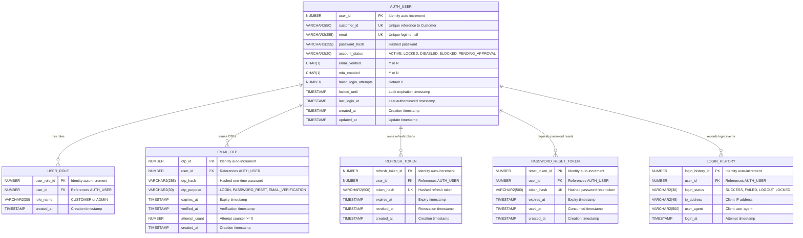
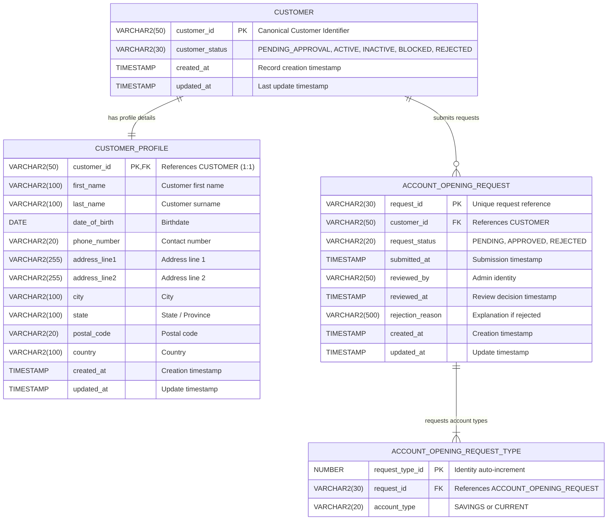
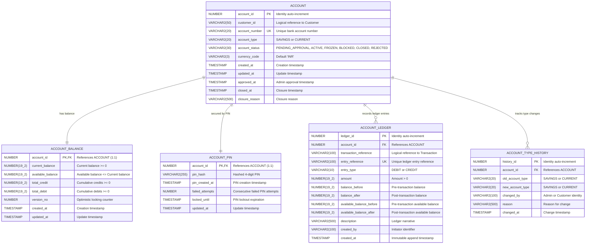
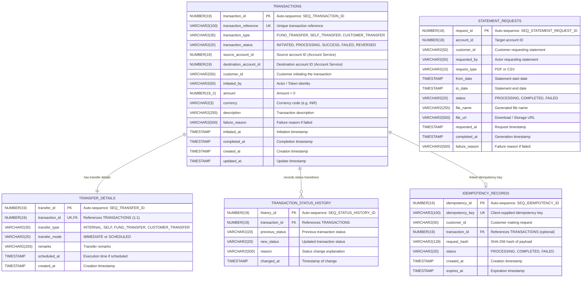
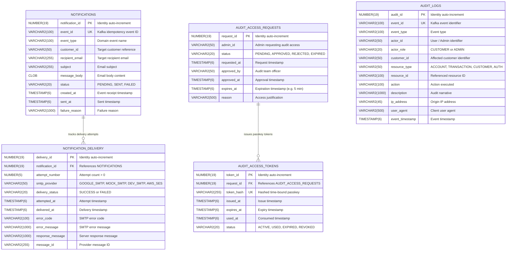
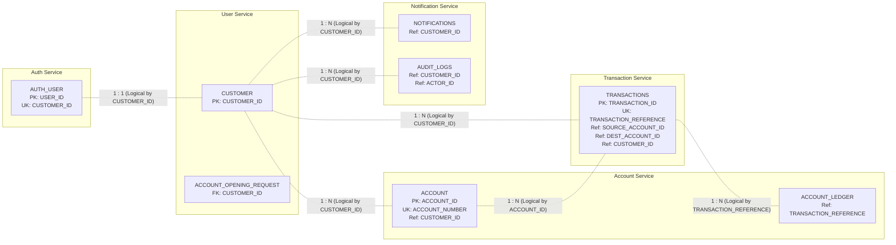

# NetBanking System - Entity Relationship (ER) Documentation

This document provides complete Entity Relationship (ER) diagrams and comprehensive data dictionaries for all 5 microservices in the NetBanking system:
1. [Auth Service (`AUTH_SCHEMA`)](#1-auth-service-auth_schema)
2. [User Service (`USER_SCHEMA`)](#2-user-service-user_schema)
3. [Account Service (`ACCOUNT_SCHEMA`)](#3-account-service-account_schema)
4. [Transaction Service (`TRANSACTION_SCHEMA`)](#4-transaction-service-transaction_schema)
5. [Notification & Audit Service (`NOTIFICATION_SCHEMA`)](#5-notification--audit-service-notification_schema)
6. [Cross-Service Logical Relationships](#6-cross-service-logical-relationships)

---

## 1. Auth Service (`AUTH_SCHEMA`)

### Responsibilities
Manages identity registration, credentials, login/logout, password reset, MFA/OTP, refresh tokens, session tracking, and user role assignments.

### Mermaid Diagram

---

## 2. User Service (`USER_SCHEMA`)

### Responsibilities
Maintains customer profile records, addresses, contact details, account opening requests, and the admin customer onboarding approval lifecycle.

### Mermaid Diagram

---

## 3. Account Service (`ACCOUNT_SCHEMA`)

### Responsibilities
Source of truth for bank account state, ledger accounting (double-entry debit/credit), current and available balances, 4-digit hashed PIN security, and account type transitions.

### Mermaid Diagram

---

## 4. Transaction Service (`TRANSACTION_SCHEMA`)

### Responsibilities
Orchestrates fund transfers, self transfers, idempotency verification, immutable lifecycle status history, and account statement requests.

### Mermaid Diagram

---

## 5. Notification & Audit Service (`NOTIFICATION_SCHEMA`)

### Responsibilities
Consumes Kafka events to send customer emails via Google SMTP, records immutable audit trails across all microservices, and manages time-bound admin audit access passkeys/tokens.

### Mermaid Diagram

---

## 6. Cross-Service Logical Relationships

In accordance with the microservice database-per-service pattern, **no physical foreign keys exist between schemas**. Cross-service references are maintained logically through canonical identifiers communicated via OpenFeign REST APIs and Kafka events.

### Cross-Service Entity Map

### Reference Resolution Matrix

| Referencing Service | Table & Column | Target Service | Referenced Entity | Resolution Mechanism |
| :--- | :--- | :--- | :--- | :--- |
| **Auth** | `AUTH_USER.CUSTOMER_ID` | User Service | `CUSTOMER.CUSTOMER_ID` | Registration event / JWT payload |
| **Account** | `ACCOUNT.CUSTOMER_ID` | User Service | `CUSTOMER.CUSTOMER_ID` | OpenFeign during account approval |
| **Account** | `ACCOUNT_LEDGER.TRANSACTION_REFERENCE` | Transaction Service | `TRANSACTIONS.TRANSACTION_REFERENCE` | OpenFeign / Saga transfer request |
| **Transaction** | `TRANSACTIONS.CUSTOMER_ID` | User Service | `CUSTOMER.CUSTOMER_ID` | JWT Claim (`customerId`) |
| **Transaction** | `TRANSACTIONS.SOURCE_ACCOUNT_ID` | Account Service | `ACCOUNT.ACCOUNT_ID` | OpenFeign verification & balance check |
| **Transaction** | `TRANSACTIONS.DESTINATION_ACCOUNT_ID` | Account Service | `ACCOUNT.ACCOUNT_ID` | OpenFeign beneficiary verification |
| **Notification** | `NOTIFICATIONS.CUSTOMER_ID` | User Service | `CUSTOMER.CUSTOMER_ID` | Kafka domain event payload |
| **Notification** | `AUDIT_LOGS.CUSTOMER_ID` | User Service | `CUSTOMER.CUSTOMER_ID` | Kafka audit event stream |
| **Notification** | `AUDIT_LOGS.ACTOR_ID` | Auth / User Service | `AUTH_USER.USER_ID` or Admin username | JWT subject / security context |
